<!-- ============================================================= -->
<!--  sioaeko · GitHub profile README                              -->
<!-- ============================================================= -->

<div align="center">


<p>
  <a href="https://github.com/sioaeko?tab=repositories">
    
  </a>
  <a href="https://github.com/sioaeko?tab=followers">
    
  </a>
  
</p>

</div>

<br>

<!-- ============================== whoami ============================== -->
<div align="center">

```yaml
sioaeko:
  focus:     [ Deep Learning, ML Systems, Full-Stack ]
  building:  [ AI tools, self-hosted infra, macOS apps ]
  interests: [ Design, Networking, Server Management ]
  runtime:   macOS · Linux · Rust · Python · TypeScript
```

</div>

<br>

<!-- ============================== tech stack ============================== -->
<div align="center">

### 🧩 Tech Stack

<table>
  <tr>
    <td align="right" width="130"><strong>Languages</strong></td>
    <td></td>
  </tr>
  <tr>
    <td align="right"><strong>Frameworks</strong></td>
    <td></td>
  </tr>
  <tr>
    <td align="right"><strong>Infra&nbsp;/&nbsp;Cloud</strong></td>
    <td>
      
      
      
    </td>
  </tr>
  <tr>
    <td align="right"><strong>Systems&nbsp;/&nbsp;OS</strong></td>
    <td>
      
      
    </td>
  </tr>
</table>

</div>

<br>

<!-- ============================== featured ============================== -->
<div align="center">

### 📦 Featured Projects

<table>
  <tr>
    <td width="50%" valign="top">
      <a href="https://github.com/sioaeko/OpenVoiceChanger"><b>🎙️ OpenVoiceChanger</b></a><br>
      Real-time voice changer built on RVC, WebSockets and ONNX / TensorFlow / PyTorch.<br>
      
      
    </td>
    <td width="50%" valign="top">
      <a href="https://github.com/sioaeko/NLLB_translator"><b>🌐 NLLB_translator</b></a><br>
      Multi-engine neural translator across 200 languages — local NLLB-200 / MADLAD / Ollama.<br>
      
      
    </td>
  </tr>
  <tr>
    <td width="50%" valign="top">
      <a href="https://github.com/sioaeko/StatusWatch"><b>📊 StatusWatch</b></a><br>
      Real-time dashboard for uptime, response times and SSL certificate monitoring with alerts.<br>
      
      
    </td>
    <td width="50%" valign="top">
      <a href="https://github.com/sioaeko/Lunasocks"><b>🚀 Lunasocks</b></a><br>
      High-performance SOCKS5 proxy with TLS, pluggable auth and a web management interface.<br>
      
      
    </td>
  </tr>
  <tr>
    <td width="50%" valign="top">
      <a href="https://github.com/sioaeko/Deeptube-Youtube-Downloader"><b>📥 Deeptube</b></a><br>
      Clean video / audio downloader for YouTube.<br>
      
      
    </td>
    <td width="50%" valign="top">
      <a href="https://github.com/sioaeko/HFModelDownloader"><b>🤗 HFModelDownloader</b></a><br>
      Chunked downloader that splits &amp; reconstructs large Hugging Face model files.<br>
      
      
    </td>
  </tr>
</table>

</div>

<br>

<!-- ============================== metrics ============================== -->
<div align="center">

### 📈 GitHub Metrics



<sub>Auto-generated hourly as a static SVG — no rate-limited external stat cards.</sub>

</div>

<br>


